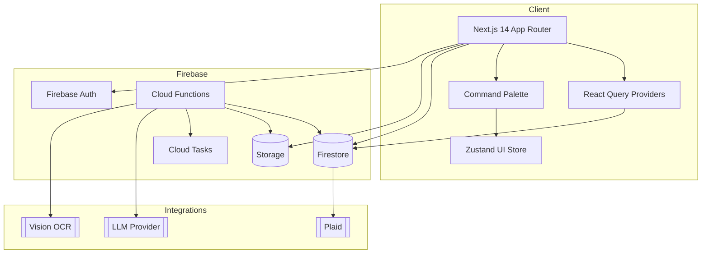

# Architecture diagram

```mermaid
graph TD
  subgraph Client
    Dashboard[Next.js 14 App Router]
    CommandPalette[Command Palette]
    ZustandStore[Zustand UI Store]
    TanStack[React Query Providers]
  end

  subgraph Firebase
    Auth[Firebase Auth]
    Firestore[(Firestore)]
    Storage[(Storage)]
    Functions[Cloud Functions]
    Tasks[Cloud Tasks]
  end

  subgraph Integrations
    Plaid[[Plaid]]
    Vision[[Vision OCR]]
    LLM[[LLM Provider]]
  end

  Dashboard --> TanStack
  Dashboard --> CommandPalette
  CommandPalette --> ZustandStore
  TanStack --> Firestore
  Dashboard --> Firestore
  Dashboard --> Storage
  Functions --> Firestore
  Functions --> Storage
  Functions --> Tasks
  Functions --> LLM
  Functions --> Vision
  Firestore --> Plaid
  Dashboard --> Auth
```
